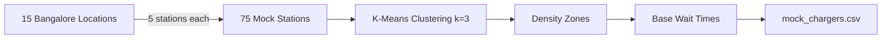
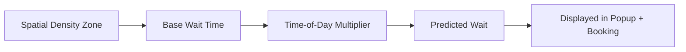

# ⚡ SEVRAN — Smart EV Routing & Availability Network

> **Hackathon Theme:** Seamless EV Charging Ecosystem  
> Real-time charging intelligence for Bangalore — powered by AI-driven density clustering

---

## 🌍 Overview

As EV adoption accelerates across India, drivers face a fragmented charging experience — multiple provider apps, no live availability, unpredictable wait times, and separate payment systems for each network.

**SEVRAN** solves this by aggregating **5 major charging networks** into a single intelligent dashboard that provides:

- 📡 **Live charger availability** across all providers
- 🧠 **AI-predicted wait times** using K-Means density clustering
- 🗺️ **Smart routing** with animated path visualization and ETA
- 💳 **Unified payments** — book and pay across any network with one wallet

---

## 🎯 Problem Statement

| Pain Point | SEVRAN Solution |
|-----------|----------------|
| Drivers juggle 3–5 different provider apps | One unified map aggregating all networks |
| No way to check if a charger is free before arriving | Real-time status: Available / In Use / Offline |
| Unpredictable queues at popular stations | AI wait prediction based on spatial density + time-of-day |
| Separate wallets and accounts per provider | Single Unified Wallet for cross-network payments |
| No smart route planning to nearest available charger | Distance calculation, ETA, and animated route visualization |

---

## 🚀 Features

### 1. 📡 Live Availability Map
Interactive Folium map on a dark CartoDB basemap displaying all charging stations with color-coded status markers:
- 🟢 **Green** — Available
- 🟠 **Orange** — In Use
- 🔴 **Red** — Offline

Each marker has a rich popup showing station name, provider, charger type, power output, AI-predicted wait time, pricing, rating, and amenities.

### 2. 🧠 AI-Powered Wait Prediction
Repurposed **K-Means clustering** algorithm to classify Bangalore into three spatial density zones:

| Zone | Cluster | Base Wait Time |
|------|---------|---------------|
| 🔴 High Density (City Center) | Cluster 0 | 12–25 min |
| 🟠 Medium Density | Cluster 1 | 5–15 min |
| 🟢 Low Density (Outskirts) | Cluster 2 | 0–8 min |

Wait times are dynamically adjusted based on **time-of-day peaks**:
- **Morning Peak (8–10 AM):** 1.8× multiplier
- **Evening Peak (5–8 PM):** 2.0× multiplier
- **Lunch (12–2 PM):** 1.3× multiplier
- **Late Night (10 PM–5 AM):** 0.5× multiplier

An interactive **hour slider** in the sidebar lets users simulate any time of day.

### 3. 🔗 Network Interoperability
Five major Indian EV charging providers unified in one view:

| Provider | Pricing Range |
|----------|--------------|
| Tata Power EZ Charge | ₹14–16/kWh |
| ChargeZone | ₹12–15/kWh |
| Ather Grid | ₹13–15.5/kWh |
| Statiq | ₹15–18/kWh |
| JEEV | ₹11–14/kWh |

Sidebar multiselect filters allow toggling any combination of providers, charger types (AC Level 2, DC Fast CCS2, DC Fast CHAdeMO), and statuses.

### 4. 💳 Unified Payment & Booking
- **Unified Wallet** with ₹2,500 starting balance
- Select any available station → adjust charge duration (15–120 min)
- Real-time cost calculation: `(duration ÷ 60) × power_kW × ₹/kWh`
- One-click **"Book & Pay"** with instant wallet deduction
- Booking history tracked in the sidebar
- Add funds with quick-add buttons (₹500 / ₹1,000)

### 5. 🗺️ Smart Routing
- Animated **AntPath** route line from user location to selected station
- **Haversine distance** calculation with ETA (based on Bangalore avg traffic speed)
- Total trip time estimate: ETA + Wait Time + Charge Duration

---

## 🧰 Tech Stack

| Category | Tools / Libraries |
|---------|-------------------|
| **Language** | Python 3.x |
| **Dashboard** | Streamlit |
| **Mapping** | Folium, AntPath plugin |
| **ML / Clustering** | Scikit-learn (K-Means) |
| **Data Processing** | Pandas, NumPy |
| **Geospatial** | Geopy, Haversine |
| **Visualization** | Matplotlib, Seaborn |
| **API (Original)** | OpenChargeMap API |

---

## 📂 Project Structure

```text
ev_sales/
│
├── app.py                  # Streamlit dashboard (SEVRAN)
├── generate_mock_data.py   # Mock data generator (75 Bangalore stations)
├── mock_chargers.csv       # Generated prototype dataset
│
├── requirements.txt        # Python dependencies
└── README.md               # This file
```

---

## 🛠️ Getting Started

### Prerequisites

Ensure you have **Python 3.9+** installed.

### 1. Clone the Repository
```bash
git clone https://github.com/ys09123/EV_sales.git
cd EV_sales
```

### 2. Install Dependencies
```bash
pip install -r requirements.txt
```

### 3. Generate Mock Data
```bash
python generate_mock_data.py
```
This creates `mock_chargers.csv` with 75 charging stations across 15 Bangalore neighborhoods.

### 4. Launch the Dashboard
```bash
streamlit run app.py
```
Open **http://localhost:8501** in your browser.

---

## 🎮 Demo Walkthrough

1. **Explore the Map** — Pan and zoom across Bangalore to see all 75 charging stations with live status colors
2. **Filter by Provider** — Toggle providers in the sidebar to demonstrate network interoperability
3. **Simulate Peak Hours** — Drag the hour slider to 9 AM or 6 PM to see wait times spike and the animated "PEAK HOUR" badge
4. **Route to a Station** — Select a station from the "Route to station" dropdown to see the animated path and distance
5. **Book & Pay** — Select an available station in the booking panel, set charge duration, and click "Book & Pay" to see wallet deduction and booking confirmation
6. **Add Funds** — Use the "＋ ₹500" or "＋ ₹1,000" buttons in the sidebar wallet

---

## 🧠 Methodology

### Data Generation Pipeline



### AI Wait Prediction Pipeline



---

## 📊 Data Summary

| Metric | Value |
|--------|-------|
| Total Stations | 75 |
| Bangalore Areas | 15 |
| Providers | 5 |
| Charger Types | 3 (AC Level 2, DC CCS2, DC CHAdeMO) |
| Status Distribution | ~50% Available, ~35% In Use, ~15% Offline |
| Density Zones | High (30), Medium (30), Low (15) |

---

## 🗺️ Coverage Areas

Koramangala · Indiranagar · Whitefield · Electronic City · MG Road · HSR Layout · JP Nagar · Marathahalli · Hebbal · Jayanagar · Bannerghatta Road · Rajajinagar · Yelahanka · Sarjapur Road · Malleshwaram

---

## 🔮 Future Scope

- [ ] **Real-time API integration** — Replace mock data with live OpenChargeMap / provider APIs
- [ ] **Road-based routing** — Integrate OpenRouteService for actual road paths instead of straight lines
- [ ] **User authentication** — Login system with persistent wallet and booking history
- [ ] **Push notifications** — Alert when a booked charger becomes available
- [ ] **Payment gateway** — Integrate Razorpay / Stripe for real transactions
- [ ] **Multi-city expansion** — Extend to Delhi, Mumbai, Hyderabad, Chennai
- [ ] **EV battery estimation** — Recommend charge duration based on vehicle battery level

---

## 🙌 Contributing

Feel free to fork, star, or open issues. PRs for adding real API integrations, new cities, or improved ML models are welcome!

---

## 👤 Author

**Yash Shaw**  
Data Science · Machine Learning · Geospatial AI

---

<div align="center">

⚡ **SEVRAN** — Making EV charging seamless, intelligent, and unified.

</div>
